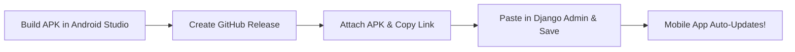

# SURE ProEd - Backend Operations & Deployment Runbook

This runbook outlines the operational procedures, commands, and deployment strategies for the SURE ProEd backend infrastructure, based on the live production VM configuration.

## A. Development Startup
For local development, use the standard Django development server and Celery.
```bash
# Start Django Server (with SQLite for local dev)
USE_SQLITE=true python manage.py runserver

# Start Celery Worker
python manage.py celery -A config worker -l info

# Start Celery Beat
python manage.py celery -A config beat -l info
```

## B. Production Deployment
The production backend operates via Gunicorn utilizing ASGI workers (UvicornWorker) to support WebSockets, coupled with systemd for process management.

```bash
# Typical Deployment Steps
git pull
source venv/bin/activate
pip install -r requirements.txt # (If dependencies changed)
python manage.py check
python manage.py showmigrations
python manage.py migrate # (ONLY if required)
python manage.py collectstatic --noinput # (ONLY if static files changed)

# Graceful reload (zero downtime)
kill -HUP $(systemctl show -p MainPID --value gunicorn.service)
# Or restart entirely:
# sudo systemctl restart gunicorn.service
```

## C. Database Migration
**Database Engine**: PostgreSQL (`postgresql@16-main.service`)

Check unapplied migrations:
```bash
python manage.py showmigrations
```

Create new migrations (ONLY when models genuinely change; not needed for views/services/frontend changes):
```bash
python manage.py makemigrations
```

Apply migrations:
```bash
python manage.py migrate
```
> [!WARNING]
> Do NOT tell developers to blindly run `makemigrations` for every code change. Model changes require migrations. View, serializer, service, and frontend changes DO NOT require backend migrations.

## D. Django Checks
Run system checks to detect configuration or code issues before restarting services:
```bash
python manage.py check
```

## E. Backend Tests
Run the full backend test suite or focus on specific modules:
```bash
# Full suite
USE_SQLITE=true python manage.py test

# Offer Letter tests
USE_SQLITE=true python manage.py test applications.tests_offer_letter

# Cohort Chat tests
USE_SQLITE=true python manage.py test cohorts.tests_chat
```
*Note: We recommend running tests using SQLite locally/in CI to avoid modifying the production Postgres database.*

## F. Celery Worker
**Service Name**: `celery.service`
**Production Command**: 
```bash
/home/dev1/pradeep-backend/venv/bin/celery -A config worker --loglevel=info
```
The Celery worker asynchronously processes background tasks (e.g., Offer Letter generation, sending emails).
To verify it is alive: `systemctl status celery.service`

## G. Celery Beat
**Service Name**: `celerybeat.service`
**Production Command**: 
```bash
/home/dev1/pradeep-backend/venv/bin/celery -A config beat --loglevel=info
```
Celery Beat schedules periodic tasks based on `CELERY_BEAT_SCHEDULE`. Both worker and beat are required for automatic Offer Letter generation.
> [!IMPORTANT]
> Existing attendance and class schedules must continue running. Do not restart or modify Celery schedules unnecessarily.

## H. ASGI / WebSocket Server
**Service Name**: `gunicorn.service`
**Production Command**:
```bash
/home/dev1/pradeep-backend/venv/bin/gunicorn config.asgi:application -k uvicorn.workers.UvicornWorker -w 4 --bind 0.0.0.0:8000
```
The upstream reverse proxy reaches this VM from `192.168.0.99` on port 8000.
Gunicorn therefore listens on the VM interface, and UFW must allow the private
gateway before denying port 8000 to every other source. The application-level
admin host guard provides a second independent control.

The production environment must use the public DNS names only:

```dotenv
DEBUG=False
ALLOWED_HOSTS=api.sureproed.com,localhost,127.0.0.1
ADMIN_ALLOWED_HOSTS=api.sureproed.com
ADMIN_PORTAL_URL=https://api.sureproed.com/secure-admin/
CSRF_TRUSTED_ORIGINS=https://sureproed.com,https://www.sureproed.com,https://api.sureproed.com
CORS_ALLOWED_ORIGINS=https://sureproed.com,https://www.sureproed.com
CORS_ALLOW_ALL_ORIGINS=False
USE_X_FORWARDED_HOST=False
SECURE_SSL_REDIRECT=True
```

Install `deployment/nginx/sureproed.conf` as the Nginx site after confirming the
certificate and application paths. Its default virtual hosts drop direct-IP and
unknown-host requests. The upstream gateway remains the production domain path.

**Graceful Reload**: `kill -HUP <gunicorn-master-pid>`
**Full Restart**: `sudo systemctl restart gunicorn.service`

## I. Static Files
Static files are configured to collect into `BASE_DIR / "staticfiles"`.
```bash
python manage.py collectstatic
```

## J. Media / File Storage
Media files (including generated Offer Letters) are stored locally at `BASE_DIR / "media"`.

## K. Frontend Integration Requirements
When deploying the frontend, ensure the proxy configuration correctly points to the backend.
- **REST API Proxy**: `https://api.sureproed.com`
- **WebSocket Proxy**: `wss://api.sureproed.com`

If the Vite proxy configuration changes, the frontend development server (`npm run dev`) must be restarted.

## L. Logs
Use `journalctl` to view live production logs:
```bash
# Gunicorn Logs
journalctl -u gunicorn.service -f

# Celery Worker Logs
journalctl -u celery.service -f

# Celery Beat Logs
journalctl -u celerybeat.service -f
```

## M. Restart Commands
```bash
# Restart ASGI Server
sudo systemctl restart gunicorn.service

# Restart Celery Worker
sudo systemctl restart celery.service

# Restart Celery Beat
sudo systemctl restart celerybeat.service

# Restart Nginx
sudo systemctl restart nginx.service
```

## N. Health Checks
1. Check process status: `systemctl status gunicorn celery celerybeat nginx`
2. Test REST API internally: `curl -I -H 'Host: api.sureproed.com' -H 'X-Forwarded-Proto: https' http://127.0.0.1:8000/api/some-endpoint/`
3. Verify WebSocket publicly: Connect a WebSocket client to `wss://api.sureproed.com/ws/cohort-chat/<id>/?token=<token>`

### Block direct-IP access

After updating the systemd `ExecStart`, Nginx configuration, and production
environment:

```bash
# From /home/dev1/pradeep-backend:
sudo install -D -m 0644 deployment/systemd/gunicorn.service.d/override.conf \
  /etc/systemd/system/gunicorn.service.d/override.conf

sudo systemctl daemon-reload
sudo systemctl restart gunicorn.service
sudo nginx -t
sudo systemctl reload nginx.service

# Preserve SSH, remove the broad application-port rule, permit the private
# reverse-proxy gateway, and deny every other source.
sudo ufw allow 2222/tcp
sudo ufw delete allow 8000/tcp
sudo ufw allow proto tcp from 192.168.0.99 to any port 8000
sudo ufw deny 8000/tcp
sudo ufw --force enable

# Expected: connection refused or timed out.
curl -I --max-time 5 http://106.51.129.34:8000/secure-admin/

# Expected: connection closed/404; never a Django admin response.
curl -I --max-time 5 http://106.51.129.34/secure-admin/

# Expected: 200 or the normal admin authentication redirect via HTTPS.
curl -I https://api.sureproed.com/secure-admin/exams/starttest/hub/

# Expected: the gateway allow rule appears before the general port-8000 deny.
sudo ufw status numbered
```

## O. Rollback Procedure
If a deployment fails:
1. Revert git commit: `git checkout <previous-commit-hash>`
2. Revert migrations if they were applied (e.g., `python manage.py migrate app_name <previous-migration>`)
3. Reload Gunicorn: `kill -HUP <gunicorn-master-pid>`
4. Monitor logs to ensure stability.

## P. Common Troubleshooting

| Problem | Check | Fix |
|---|---|---|
| REST 404 | Check `urls.py` and Gunicorn logs | Correct URL registration, reload Gunicorn |
| WebSocket 403 | Check JWT validity and authorization logic | Ensure valid `token=` param and user is authorized |
| WebSocket connection closed | Check Gunicorn/Uvicorn worker logs | Ensure ASGI routing is correct and consumer handles exceptions |
| Celery task not executing | `systemctl status celery.service` | Restart celery worker |
| Celery Beat not scheduling | `systemctl status celerybeat.service` | Restart celery beat |
| Migration missing | `python manage.py showmigrations` | Run `python manage.py migrate` |
| Static files missing | Check `staticfiles/` directory | Run `python manage.py collectstatic` |
| Media files missing | Check `media/` directory permissions | Fix permissions / restore from backup |
| Offer Letter not generated | Check Celery logs for `process_automatic_offer_letters` | Fix task errors, verify cron timing |
| Notification not appearing | Check Celery logs for push/email tasks | Ensure valid push subscription/email config |
| Frontend API proxy failure | Check `vite.config.js` or Nginx conf | Restart frontend dev server or Nginx |
| Frontend WebSocket proxy failure | Check WebSocket URL and WSS vs WS | Correct proxy target to `ws://...:8000` |

---

## 7. Offer Letter Automation
**Dependency Chain:**
Django -> Celery Worker -> Celery Beat -> `process_automatic_offer_letters` -> Offer Letter generation -> Notification

Automatic generation relies on Celery Beat triggering the scheduled task daily at 12:30 AM (configured in `config/settings.py` via `CELERY_BEAT_SCHEDULE`). DO NOT change the existing schedule.

## 8. Cohort Chat
**New Backend Components:** `CohortConversation`, `CohortMessage`, `CohortChatReadState`.
**Migration:** `cohorts.0006_cohort_group_chat`

**REST Endpoints:**
- `GET /api/cohorts/{cohort_id}/chat/messages/`
- `POST /api/cohorts/{cohort_id}/chat/messages/`
- `GET /api/cohorts/{cohort_id}/chat/unread-count/`
- `POST /api/cohorts/{cohort_id}/chat/read/`
- `DELETE /api/cohorts/{cohort_id}/chat/messages/{message_id}/` (Soft deletion)

**WebSocket Endpoint:**
- `ws/cohort-chat/{cohort_id}/?token=<jwt>`

**Authorization & Suspension:**
- Only active application students, assigned mentors, and admins can participate.
- Suspended students are automatically rejected at the WebSocket connection level.
- Unread counts rely on `CohortChatReadState` advancing watermarks rather than polling.

> [!WARNING]
> The **Permission Chat** (`ws/chat/{warning_id}/`) is entirely independent and must NOT be modified when maintaining the Cohort Chat.

---

## 9. Mobile App OTA Updates (GitHub Releases + Django Admin)
**Backend Model:** `AppRelease` (`common.models`)
**Migration:** `common.0009_apprelease`
**REST Endpoint:** `GET /api/app/version-check/` (Public, `AllowAny`)

### Strategy: GitHub Releases + Django Admin
Hosting APKs as GitHub Release assets leverages Fastly/Azure global CDN for fast downloads with **zero backend server load and zero cloud infrastructure costs**.



### Step-by-Step Release Workflow (SOP)
1. **Build the APK:**
   ```bash
   cmd.exe /c "set JAVA_HOME=C:\Program Files\Android\Android Studio\jbr&& gradlew.bat assembleRelease"
   # Output binary located at: app/build/outputs/apk/release/app-release.apk
   ```
2. **Create a GitHub Release:**
   - Open GitHub repository $\to$ **Releases** $\to$ **Draft a new release**.
   - Create tag (e.g. `v1.2.0`) and release title (e.g. `SURE ProEd v1.2.0`).
   - Drag & drop `app-release.apk` into attachments and click **Publish release**.
3. **Copy Download URL:**
   - Under published release Assets, copy the link of `app-release.apk`.
   - Format: `https://github.com/<org>/<repo>/releases/download/v1.2.0/app-release.apk`
4. **Publish in Django Admin:**
   - Go to `/secure-admin/common/apprelease/` $\to$ **Add App Release**.
   - **Version Code**: `3` (matches Android `BuildConfig.VERSION_CODE`)
   - **Version Name**: `1.2.0`
   - **Download URL**: `<pasted GitHub release asset URL>`
   - **Release Notes**: Markdown summary of updates
   - **Is Active**: Checked
   - Click **Save**.

---

## 11. Git Safety & Secrets
- Run `git status`, `git diff`, and `git log --oneline -5` before deploying.
- Do NOT blindly use `git reset --hard` or overwrite production changes.
- **SECRETS**: Never commit `.env`, never paste JWTs into chat, never print production credentials in logs, and sanitize WebSocket debug logging. `VITE_*` values in frontend are client-visible and must not contain secrets.

---

## 14. Final Verification Summary (Audited on Live VM)
- **Backend Startup Command**: `/home/dev1/pradeep-backend/venv/bin/gunicorn config.asgi:application -k uvicorn.workers.UvicornWorker -w 4 --bind 0.0.0.0:8000` (restricted by UFW to the private upstream gateway)
- **Celery Worker Command**: `/home/dev1/pradeep-backend/venv/bin/celery -A config worker --loglevel=info`
- **Celery Beat Command**: `/home/dev1/pradeep-backend/venv/bin/celery -A config beat --loglevel=info`
- **Service Names**: `gunicorn.service`, `celery.service`, `celerybeat.service`, `nginx.service`
- **Migration Command**: `python manage.py showmigrations` / `python manage.py migrate`
- **Test Commands**: `USE_SQLITE=true python manage.py test`
- **Log Commands**: `journalctl -u <service_name> -f`
- **Restart/Reload**: `kill -HUP <master-pid>` or `systemctl restart gunicorn.service`
- **Redis Configuration**: `redis://localhost:6379/0` (via `redis-server.service`)
- **Database Type**: PostgreSQL (`postgresql@16-main.service`)
- **Media Storage Location**: `BASE_DIR / "media"`
- **Static Storage Location**: `BASE_DIR / "staticfiles"`
- **Frontend/API Split**: Public clients use `https://sureproed.com/` for the frontend and `https://api.sureproed.com/api/` plus `wss://api.sureproed.com/ws/` for backend traffic; UFW permits only the private upstream gateway to reach port 8000.

---

## 15. Student Application Lifecycle & Dual-Gate Pre-Screening Architecture

The application lifecycle transitions through granular screening states (`APPLIED` $\to$ `EXAM_PENDING` $\to$ `EXAM_COMPLETED` $\to$ `PRESCREENING_PENDING` $\to$ `PRESCREENING_COMPLETED` $\to$ `QUALIFIED`) before reaching cohort allocation and timetable-synchronized training.

```mermaid
flowchart TD
    Apply["1. Student Submits: APPLIED"] --> CheckExam{"Does Course Require Pre-Screen Exam?"}
    
    CheckExam -- "Yes" --> ExamPending["EXAM_PENDING (Exam Scheduled / Awaiting Attempt)"]
    ExamPending --> ExamCompleted["EXAM_COMPLETED (Test Taken)"]
    ExamCompleted -- "Failed / Disqualified" --> Dropped["REJECTED / DROPPED (Terminal)"]
    ExamCompleted -- "Passed" --> CheckInterview{"Does Course Require Pre-Screen Interview?"}

    CheckExam -- "No" --> CheckInterview
    
    CheckInterview -- "Yes" --> PreScreenPending["PRESCREENING_PENDING (Interview Scheduled / Pending)"]
    PreScreenPending --> PreScreenCompleted["PRESCREENING_COMPLETED (Interview Conducted)"]
    PreScreenCompleted -- "Failed / Disqualified" --> Dropped
    PreScreenCompleted -- "Passed" --> Qualified["QUALIFIED (Eligible, Awaiting Cohort Allocation)"]

    CheckInterview -- "No" --> Qualified
    
    Qualified --> CohortAlloc["Cohort Allocation"]
    CohortAlloc --> CohortAssigned["COHORT_ASSIGNED (Rank 0)"]
    
    CohortAssigned --> CohortActive["Cohort ACTIVE: IN_PROGRESS (Rank 1)"]
    CohortActive --> TimetableTrigger["First Class Timetable Triggered"]
    
    TimetableTrigger --> Training["Cohort & App: TRAINING (Rank 2)"]
    Training --> EndModules["Last Order of Technical Modules Completed"]
    
    EndModules --> AssignCapstone["Capstone Project Assigned"]
    AssignCapstone --> InternshipAssigned["Cohort & App: INTERNSHIP_ASSIGNED (Rank 3)"]
    
    InternshipAssigned --> CapstoneProgress["Capstone Project Work in Progress"]
    
    subgraph SoftSkillsPhase ["Soft Skills Integration Phase"]
        CapstoneProgress --> SoftSkills["Soft Skills Training & Evaluation"]
        SoftSkills --> CapstoneSubmit["Capstone Project Submitted & Evaluated"]
    end
    
    CapstoneSubmit --> Completed["Cohort & App: COMPLETED (Rank 4)"]

    style Dropped fill:#f8d7da,stroke:#f5c6cb,color:#721c24
    style InternshipAssigned fill:#fff3cd,stroke:#ffeeba,color:#856404
    style Completed fill:#d4edda,stroke:#c3e6cb,color:#155724
    style Qualified fill:#e2e3e5,stroke:#d6d8db,color:#383d41
    style SoftSkillsPhase fill:#f8f9fa,stroke:#e2e3e5,color:#383d41
```



### Granular Status Mapping & Progression Table

| Cohort Status | Application Status | Progression Rank | Description / Trigger / Phase Rules |
|---|---|---|---|
| N/A (Initial) | `APPLIED` | Pre-Screen | Application successfully submitted by the candidate. |
| N/A (Exam Gate) | `EXAM_PENDING` | Pre-Screen | Course requires an exam; exam slot is scheduled or awaiting attempt. |
| N/A (Exam Gate) | `EXAM_COMPLETED` | Pre-Screen | Candidate finished the pre-screen exam, awaiting evaluation. |
| N/A (Interview Gate) | `PRESCREENING_PENDING` | Pre-Screen | Exam passed; pre-screen interview is scheduled with an interviewer. |
| N/A (Interview Gate) | `PRESCREENING_COMPLETED` | Pre-Screen | Candidate completed the interview, awaiting evaluation. |
| N/A (Disqualified) | `REJECTED` / `DROPPED` | Terminal State | Candidate failed or was disqualified during exam or interview stage. |
| N/A (Qualified) | `QUALIFIED` | Base State | Candidate cleared all required pre-screens; awaiting cohort allocation. |
| `COHORT_ASSIGNED` | `COHORT_ASSIGNED` | **Rank 0** | Cohort has been allocated to the qualified candidate. |
| `ACTIVE` | `IN_PROGRESS` | **Rank 1** | Cohort is active, but core training sessions / timetable have not yet begun. |
| `TRAINING` | `TRAINING` | **Rank 2** | Student is actively going through the ordered technical modules. |
| `TRAINING` / `INTERNSHIP` | `INTERNSHIP_ASSIGNED` | **Rank 3** | Triggered immediately when the Capstone Project is assigned right after the last order of technical modules finishes; student executes capstone and enters the distinct Soft Skills phase. |
| `COMPLETED` | `COMPLETED` | **Rank 4** | Triggered after successful Capstone Project submission/evaluation and verification of Soft Skills completion. |

### Key Architectural Guarantees & Lifecycle Rules

1. **Granular Pre-Screening Gates**:
   - `APPLIED` $\to$ `EXAM_PENDING` $\to$ `EXAM_COMPLETED`: Controlled by `course.requires_exam`.
   - `EXAM_COMPLETED` $\to$ `PRESCREENING_PENDING` $\to$ `PRESCREENING_COMPLETED`: Controlled by `course.requires_interview`.
   - Passing all required gates transitions the record to `QUALIFIED`.
   - Failure at any screening gate leads immediately to `REJECTED` / `DROPPED`.
2. **Cohort Allocation**:
   - Only `QUALIFIED` students are allocated to a cohort, transitioning their application to `COHORT_ASSIGNED` (`Rank 0`).
3. **Cohort-to-Application Lifecycle Sync ([`cohorts.services.sync_cohort_applications_status`](file:///c:/Users/tumma/Downloads/Suretrust_Backend/cohorts/services.py))**:
   - Moving Cohort to `ACTIVE` updates enrolled students to `IN_PROGRESS` (`Rank 1`).
   - Starting the class timetable or setting Cohort to `TRAINING` updates students to `TRAINING` (`Rank 2`).
   - Progression is strictly ordered by rank (`Rank 0` $\to$ `Rank 4`) to eliminate accidental status regressions.
4. **The Core Module Trigger & Capstone Allocation Bridge**:
   - The system tracks the sequence order of course modules (`CourseModule.order`).
   - When the module with the highest sequence order finishes, it triggers the capstone allocation step.
   - The moment the Capstone Project object is linked to the application/cohort student, the application status transitions from `TRAINING` (`Rank 2`) directly into `INTERNSHIP_ASSIGNED` (`Rank 3`).
5. **Soft Skills Separation**:
   - Soft Skills are treated as a completely separate evaluation layer from the main technical module list.
   - It runs concurrently with or directly following the capstone lifecycle window to prepare students for final completion and certification (`COMPLETED`, `Rank 4`).


